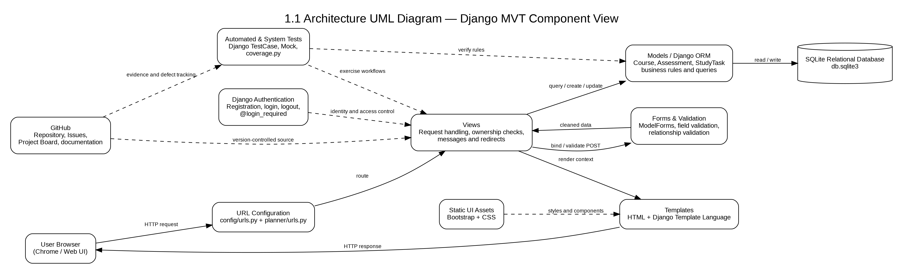
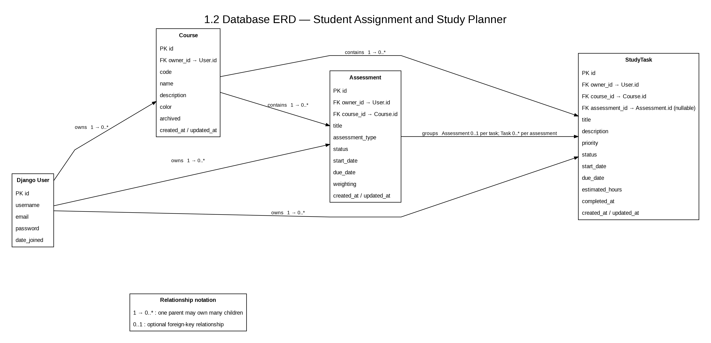
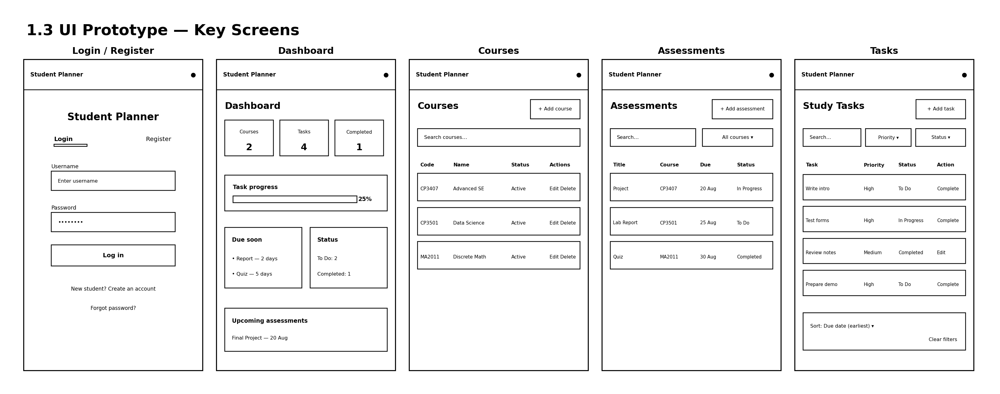

# System Design

## 1. Design Overview

The Student Assignment and Study Planner uses Django's
Model-View-Template architecture. The design separates request handling,
input validation, business rules, data storage and user-interface
presentation.

## 2. Architectural Design

The browser sends requests through Django's URL configuration. Views
handle the requests, forms validate user input, models contain the data
and business rules, and templates generate the graphical user interface.

Django authentication is used for registration, login and logout.
Ownership checks ensure that users can only access their own courses,
assessments and study tasks.

## 3. Database Design

The system uses SQLite as a relational database through Django's ORM.

The main entities are User, Course, Assessment and StudyTask. Each
Course, Assessment and StudyTask belongs to a user. Assessments belong
to courses, while study tasks belong to courses and may optionally be
associated with an assessment.

## 4. User Interface Design

The user interface contains consistent navigation and separate pages for
authentication, the dashboard, courses, assessments and study tasks.

Bootstrap components are used for forms, tables, cards, buttons and
responsive page layouts. The dashboard provides an immediate summary of
courses, task progress, overdue work and upcoming assessments.

## 5. Design Decisions

- Django MVT separates the main application responsibilities.
- Django ORM manages relational data without repeated SQL code.
- Ownership fields support user-data isolation.
- ModelForm validation prevents invalid dates and relationships.
- Bootstrap provides a consistent graphical interface.
- Dashboard summaries help users understand their current progress.
